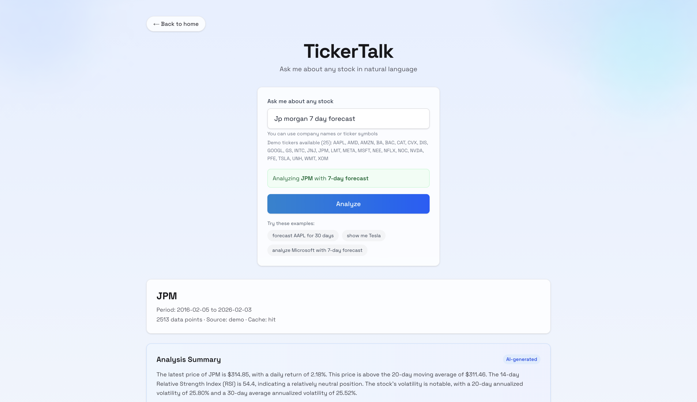

# TickerTalk - Talk to your stocks!




Natural-language stock analysis that turns queries like "forecast AAPL for 30 days" into charts, indicators, forecasts, and AI-generated explanations.

## Live Demo

- Demo: `https://sidvalecha.com/ticker-talk`

## What It Does

- Parses natural-language queries into structured analysis requests
- Computes technical indicators deterministically in Python
- Runs ARIMA forecasts with walk-forward backtesting
- Generates charts and an AI explanation grounded in computed metrics
- Caches market data to reduce API calls

## Architecture Highlights

- Deterministic compute layer (no LLM math)
- Guardrailed LLM explanations (no trading advice)
- SQLite caching with TTL to reduce upstream calls
- Graceful fallback when LLM is unavailable

## Demo Data

The app ships with a curated set of demo tickers (CSV) so it runs without external API calls. If you query a ticker outside the demo set, results depend on API availability.

## Tech Stack

- Backend: FastAPI, pandas, statsmodels, SQLite, matplotlib
- Frontend: Next.js (App Router), TypeScript, Tailwind CSS
- LLM: Groq or OpenAI (provider-agnostic client)

## API Endpoints

- `GET /health` — health check
- `POST /api/analyze` — main analysis endpoint
- `POST /api/parse_intent` — parse natural language query
- `GET /api/example_queries` — example prompts for the UI
- `GET /api/metrics` — usage metrics (requires API key if enabled)

## Local Development

### Backend

```bash
cd backend
pip install -r requirements.txt
uvicorn app.main:app --reload
```

### Frontend

```bash
cd frontend
npm install
npm run dev
```

## Environment Variables

- `ALPHA_VANTAGE_API_KEY` (optional if demo data is present)
- `GROQ_API_KEY` or `OPENAI_API_KEY` (LLM explanations)
- `LLM_PRIMARY_PROVIDER` and `LLM_FALLBACK_PROVIDER`
- `LLM_TIMEOUT_SECONDS`
- `METRICS_API_KEY` (optional; locks `/api/metrics`)

## Disclaimer

This project is for educational purposes only and is not financial advice.

## License

MIT
